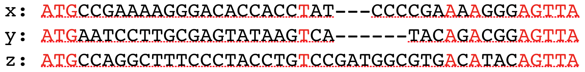
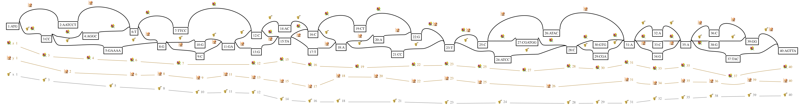
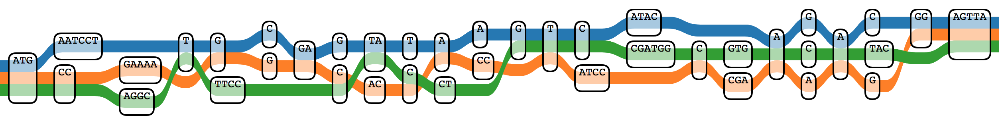

# msa2gfa

A script to extract graph structure from multiple sequence alignment result and output as GFA/JSON for vg

## Example



### Transform

```bash
$ ./msa2gfa.py -f ./sample/msa.fa > ./sample/graph.gfa
```

### Visualize

1. png

```bash
$ vg view -Fv ./sample/graph.gfa|vg view -dpn -|dot -T png -o ./small/graph.png
```



2. TubeMap

```bash
$ ./msa2gfa.py -jf ./sample/msa.fa|pbcopy
```

Transform fasta to JSON, then Copy & Paste to [GraphGenomeBrowser](http://graphgenome.tk/demo3/)



